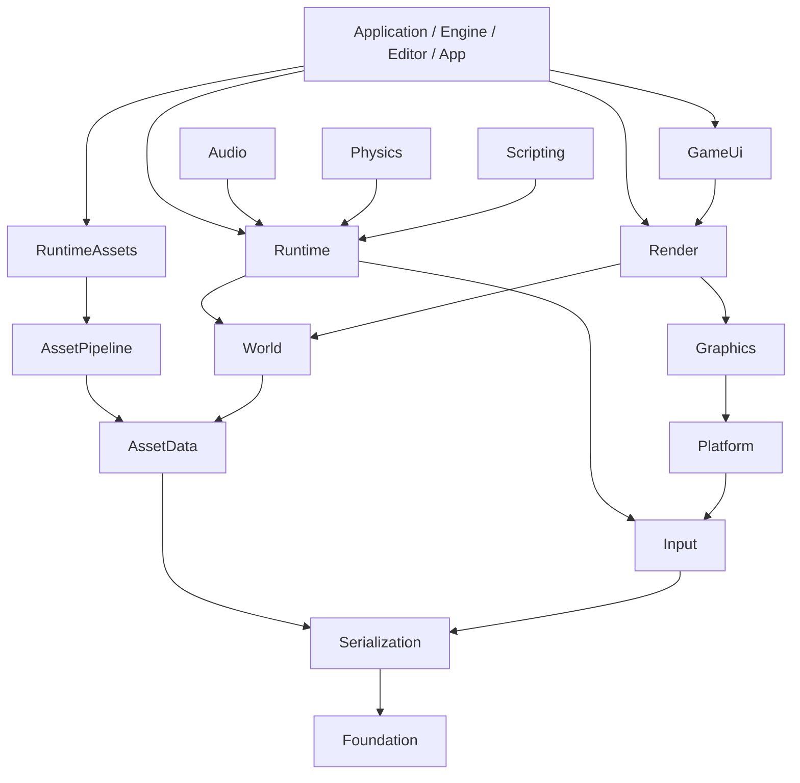

# 引擎架构与运行时边界

本文描述当前模块、所有权和关键时序。功能规划与验收见[路线图](../engine-roadmap.md)，构建和操作见 [README](../../README.md)。

## 构建模块

项目使用 `build/`、`build-editor/`、`build-release/` 三个构建目录，对外提供一个 `engine` 动态库和 `Comet::Engine` 目标。
内部对象库约束依赖与增量编译，全部汇入 engine；App、Editor 和资产准备工具直接链接 engine。
源码归属由 `engine/cmake/module_sources.cmake` 声明，依赖由 `modules.cmake` 声明。目录组织按功能，编译模块按依赖边界组织。

| 模块 | 职责 | 主要依赖 |
| --- | --- | --- |
| Foundation | 错误、文件、UUID、参数值、数学、任务、项目路径、日志和 CPU 计时 | GLM、spdlog、Threads |
| Serialization | 文件编解码流程、错误定位、JSON 编解码 | Foundation、simdjson |
| ShaderContracts | 后端无关 Shader 契约与 SPIR-V 反射 | Foundation、SPIRV-Reflect |
| AssetData | Handle、Registry、CPU 产品数据、脚本定义和资产字段序列化 | Serialization、ShaderContracts |
| Input | 采样值、动作、输入组、运行域求值、改键草稿和覆盖 | Serialization |
| World | 实体、组件、描述符、层级、场景内容保存与复制 | AssetData、EnTT |
| Runtime | 时间、暂停／单步、会话与 System 生命周期 | World、Input |
| Audio | AudioService、Voice、播放设备与 AudioSystem | Runtime、miniaudio |
| Physics | PhysicsService、刚体世界与 PhysicsSystem | Runtime、Jolt |
| Scripting | 行为 VM、Lua 校验与 ScriptSystem | Runtime、Lua |
| AssetPipeline | 扫描、索引、源导入、Artifact 与任务队列 | AssetData、stb_image、fastgltf |
| RuntimeAssets | 需求、加载、失效、版本编排和资源发布契约 | AssetPipeline、Audio／Script 定义 |
| Platform | Window、GLFW 事件、输入采样与剪贴板 | Input、GLFW |
| Graphics | Vulkan／VMA、设备、资源、命令、同步与 Surface | ShaderContracts、Platform |
| Render | 帧、呈现、场景提取、渲染与资产 GPU 发布 | Graphics、World、Platform |
| GameUi | RmlUi 会话、输入／GPU 适配和项目控制器 | Render、Platform、RmlUi、Lua |

Project、Profile、玩家设置聚合、Application 与 Engine 是组合层。WindowSettings、VulkanSettings、RenderSettings、AudioSettings 等值类型仍归所属功能模块。
模块接收自身所需参数，不接收完整 Config。Shader 编译工具是生成 Shader 所需的独立进程，复用 Foundation，不反向链接 engine。

## 模块依赖方向

下图箭头表示依赖；组合层可以装配各模块，模块不反向访问宿主。

- World 和 Runtime 不包含窗口、渲染或具体服务后端。System 从 Scene 取得参数，通过明确服务同步，后端不访问 Scene。
- AssetData 不依赖导入或运行实例。RuntimeAssets 不包含渲染对象；`asset/runtime/render_asset_publisher.h` 声明发布契约，Render 提供实现。
- Render 消费提取数据和资源服务，不读取项目文件或访问 AssetManager；Graphics 不反向依赖 Render。
- Jolt、miniaudio、Lua、GLFW 等头只进入所属后端或适配实现。Engine 不包含 Editor／ImGui。
- Editor 分为无 ImGui 的 `editor_core`、呈现适配 `editor_imgui` 和功能界面 `editor_ui`。Engine 由宿主组合，功能代码显式借用所属模块的工作流和帧快照。
- Renderer 公共头前置声明帧调度、呈现和 Overlay 类型；需要调用这些类型的集成代码显式包含相应头文件。

CTest 检查直接及传递 include，并在临时副本中验证反向依赖会被拒绝。日志、组件描述符、Registry 和第三方全局状态保留唯一所有权。

## Owner 结构

| Owner | 拥有 | 借用／交付 |
| --- | --- | --- |
| Engine | Window、Scene、Registry、TaskScheduler、Renderer、Runtime、音频与物理服务 | 同步调用宿主钩子；提供运行和渲染入口 |
| SceneRuntime | RuntimeSession 和 System 实例 | 借用当前 Scene 与 RuntimeServices，停止后结束借用 |
| System | 脚本实例或实体／组件绑定 | 借用资产定义和服务；同步配置，回写输出 |
| AssetManager | 加载、导入任务、失效和发布编排 | 借用索引与 Registry，通过 RenderAssetPublisher 发布 GPU 版本 |
| Renderer | 图形上下文、资源服务、帧调度、呈现和场景渲染状态 | 交付离屏帧／诊断快照；在途 slot 保活所用版本 |
| EditorAssets | 编辑器项目索引、源文件操作、资产管理和引用维护 | Worker 交付候选；主线程复核并提交 |
| EditorSceneSession／SceneDocument | 保留的 Edit 内容、Play 切换、文档路径和保存点 | 通过 Engine 激活场景；命令历史只编辑 Edit 内容 |
| 宿主玩家设置／ProjectUi | 玩家选择实例、页面和独立 UI 控制器 | 宿主注入读取、保存、应用及确认服务 |

Worker 读取源码、准备 CPU 产品和候选；主线程发布索引、Registry 和 GPU 版本。文件监听只提示复核，不直接修改世界或资源。
候选携带实际输入和版本身份，过期结果拒绝发布；连续保存沿既有任务背压和最新请求合并流程处理。
源文件操作属于 `editor/assets`，运行时加载属于 AssetManager；两者共享索引，分别负责自己的工作流。

## 应用启动与失败清理

启动入口加载当前 Profile。App 再合成项目默认值与玩家选择；Editor 合成本地窗口状态，游戏显示设置只用于项目视口。
Engine／Renderer／设备等工厂先准备完整 owner，成功后交付；部分准备失败随局部对象清理，不发布空句柄成功对象。
`on_init` 开始后，预期错误沿 Result 返回，关闭顺序为 Engine 停止准备、宿主清理、Engine 销毁、Diagnostics 释放。
宿主关闭钩子只执行一次，并能清理部分初始化。未预期异常不由 run／launch 捕获；第三方解析异常在对应适配层转换。
项目描述损坏时启动失败；Editor 的启动场景损坏可报告后打开空场景，供修复，不覆盖源文件。

## 一帧经过哪里

1. Engine 处理事件与时间，宿主 `on_update` 消费上次 UI 请求、维护资产与切换模式。
2. Renderer 回收上传并准备 slot／交换链；帧就绪时调用 `on_frame_ready`，收集 ImGui 请求、属性编辑、Gizmo 和输入授权。
3. `on_runtime_input` 交付只读授权快照；Runtime 执行有界 Fixed Update，再执行一次普通 Update。
4. SceneExtractor 更新世界变换并复制渲染值；SceneResolver 解析资源，生成 RenderSubmission。
5. SceneRenderer 准备几何与光照，各通道裁剪、分组并录制绘制；场景、后处理与 Overlay 完成后提交并呈现。

数据链为 `Scene → SceneExtractor → RenderScene → SceneResolver → RenderSubmission → SceneRenderer`。
RenderScene 是不借用组件的 CPU 快照，由 Engine 持有并复用容量；其头文件只依赖数学、资产身份和场景值契约，不传递包含组件或后端实现。
RenderSubmission 保活当前实际资源，Scene 不持有 GPU 对象。Renderer 复用当前提交的槽位；资产发布变化、
空场景、隐藏／延期帧和关闭时释放当前引用，在途 slot 仍独立保活已使用的 GPU 版本。

Scene 的进程内实例代号与实体 ID 共同识别对象，WorldTransform 的版本只在脏节点同步时增加。
提取与解析按身份／版本省去未变矩阵的重复复制；Registry 的成功注册、替换、移除和清空改变总发布版本，
解析器只在发布版本与输入 Handle 均未变时复用资源。注册／替换失败不改变 Registry 版本，运行时材质参数继续使用材质自身版本。
这些身份不写入场景文件，复制场景获得新的实例代号；没有实例／变换版本的手工渲染数据每次重新计算矩阵和界限。

Registry 的既有资源条目同时记录各自的发布版本，解析器把实际 Mesh 版本复制到提交；移除后重新注册获得新版本，移动注册表保留资源版本。
RenderGeometry 保留按槽位核对身份、变换与 Mesh 版本的界限值；重排、增删、场景切换和 Mesh 发布会重新计算相关槽位，
发布材质、纹理或 Shader 不使其他 Mesh 界限失效。没有 Mesh 版本的手工提交每次重算，不依赖裸资源地址判断身份。主视图与阴影共用界限，
场景界限每帧合并有效物体，删除物体后也能收缩。借用本帧提交的指针在录制结束时清空，界限缓存不保活 Mesh 或组件。
Mesh／Texture 的公共头只声明上传数据类型，CPU 数据定义由需要读取或构造数据的实现显式包含；AssetLoader 的公共头同样只借用数据库声明。
帧延期时跳过 UI／提取／绘制，Runtime 仍推进；最小化时等待并重置墙钟增量和待处理输入。
Editor 先完成即时属性编辑再提取，拾取反馈在场景和 Overlay 录制前应用。场景切换统一结束旧交互、清理失效请求并重绑选择与引用。

### 输入主链与配置边界

Window 采样键鼠和标准手柄；Input 保存只读物理快照，RuntimeInput 按授权和阶段求值动作。
Fixed Update 累积边沿，重复阶段不重复消费；失焦、连接变化和授权恢复只建立基线，不伪造按下。
App 依据最终 UI 状态授权，Editor 依据视口焦点／悬停授权；输入屏蔽不等同于暂停模拟。

| 设置来源 | 保存位置 | 负责内容 |
| --- | --- | --- |
| C++ 默认值 | 所属模块的设置结构 | 完整、可运行的基础默认值 |
| 开发者 Profile | `config/profiles.json` 的对应分组 | 诊断、底层格式／交换链／在途帧参数、资源预算；启动只选择一个分组，缺省值来自 C++ |
| 项目默认值 | `project.json` | 游戏显示、画质、音量、输入和 UI 入口 |
| 玩家选择 | 按项目 UUID 隔离的用户目录 | display／quality／audio 完整设置与输入稀疏覆盖 |
| 编辑器本地状态 | 用户／项目本地状态目录 | 窗口、布局、快捷键、最近项目和会话 |

Profile 拒绝玩家设置及未知字段。窗口尺寸与最大化状态由宿主持久化；Window 只维护原生窗口与还原尺寸。
`config/player_settings` 用一份 `PlayerSettings<T>` 实现显示、画质和音量的文件检查、版本／项目身份校验、原子保存和保存后应用。
别名保留各功能名称，具体类型的字段读取／写入／校验仍归 DisplaySettings、QualitySettings、AudioSettings。
输入文件是按动作／绑定身份合并的覆盖，保留 PlayerInputSettings 的独立协议，不套用完整值存储。
App 的显示试用由 DisplaySettingsPreview 保存前态和 15 秒期限；确认成功才持久化，取消／超时恢复前态。Editor Play 只应用视口相关设置。

### 序列化与复用边界

| 位置 | 共享能力 | 调用方负责 |
| --- | --- | --- |
| `common/file_io` | 文本读取、有大小上限的二进制读取、原子文本／二进制分块写入 | 文件是否可缺失、预算和业务提交顺序 |
| `common/binary` | 小端整数／浮点数、带长度的字符串读写、分块 FNV-1a 哈希 | Magic、版本、长度前缀宽度、字段限制与领域校验 |
| `common/serialization` | 来源／字段错误定位、Serializer 文件加载／保存流程 | 格式选择和领域编解码 |
| `common/json` | simdjson 解析、对象／数组检查、必填与可选标量字段读取、固定长度浮点向量读写、键校验、可选路径查找、可缺失文件读取、Writer、编解码入口 | 项目、场景、材质等 Schema 与版本，缺省值、颜色及数值范围的领域校验 |

项目、资产、开发者 Profile 与快捷键共用 JSON 工具。JSON DOM 借用 parser；`Json::deserialize` 的回调必须返回拥有数据的结果。
快捷键冲突、资产身份、范围等属于具体功能，不放入通用 Reader。
Editor 的窗口、最近项目、项目会话与玩家输入／显示／画质／音量设置共用可缺失 JSON 文件的读取入口：缺失返回空值，已有文件的错误正常上报，不改写原文件。
各工作流决定默认值、保存时机与内存提交规则，解码结果拥有数据，错误来源字符串覆盖整个解析寿命。
资产 Serializer 不再拥有通用 JSON 文件工具。场景描述符共用于保存、恢复、编辑与内容复制；内容 clone 直接走内存快照，不通过 JSON 往返。
Mesh、ShaderProgram、Environment Artifact 与导入指纹共用二进制基础工具；各资产保留独立头部、版本与校验规则。
Environment 按纹理读取，发布时将头部和四份纹理存储分块原子写入，避免再复制一份完整像素 payload。

### 系统更新与场景边界

Scene 保存实体身份、组件和层级；结构请求在阶段末提交，遍历中不直接改变结构。RuntimeSession 保存本局值、输入组请求和重开意图。
父子关系只由 Scene 修改并保持无环；子树删除直接遍历子节点索引，收集完毕后从后代向祖先清理。
Runtime 统一控制系统启停、部分启动失败、暂停和单步；System 不重复实现生命周期状态机。
ScriptSystem 先执行玩法，PhysicsSystem 同步配置并模拟／回写，接触随后交付脚本；AudioSystem 同步声音源。
物理后端仅接收借用参数及身份值；系统检查必需组件和父级，后端在新建／变化时校验值域。
运动学目标旋转不变时复用四元数，仍每步更新速度。当前仍扫描刚体并比较参数，完整结构增量同步和 Jolt 并行尚未实现。
AudioService 拥有设备和 Voice，PhysicsService 拥有 Jolt 世界和刚体；System 只保存实体绑定，不让内容组件持有后端对象。
动态姿态只回写实际活动或本步状态变化的刚体；删除／重建和休眠接触使用有效身份，旧请求不绑定到复用槽位。

## Lua 脚本与参数

- `asset/script` 保存不可变入口／模块源码、字段默认值和事件声明，不依赖 Entity、Runtime 或 VM。
- `scripting/script_instance` 拥有每实体独立的 VM、定义／self 和模块缓存；ScriptSystem 保存实际运行定义并调度。
- ScriptComponent 保存 Handle 与稀疏参数覆盖；`common/parameters` 共享参数类型和过滤规则，普通参数编辑不重建实例。
- Inspector Edit 查询资产定义，Play 查询实际实例定义。查询核对场景、实体和组件寿命，返回值不延长实例寿命。

源码重载先准备并校验关联资产及候选 VM；准备失败保留旧版，成功后逆序停止旧实例并启动新版。
新版 `on_start` 或运行回调已可能修改世界，执行失败沿 Runtime 停止／Editor 恢复 Edit 路径处理，不承诺回滚副作用。
换版保留兼容参数覆盖，重建 self／模块，不迁移任意 Lua 状态，也不自动改写 Edit 内容；暂停时待继续或单步再换版。
项目 require 使用预先冻结的源码闭包，实例只执行已准备模块，不在运行回调中查找文件。模块为 source-only，不创建资产身份。
内存、指令、日志、实体／事件请求都有预算；实体和接触交付在阶段边界复核身份，停止回调不访问 Scene。
ScriptSystem 不监听文件、不另建资产版本缓存；UI 控制器的 VM 与行为实例分别拥有权限和寿命。

### 脚本材质覆盖

场景组件保存参数覆盖，运行实例只覆盖对应实体；共用 Material 资产保持原内容。
字段类型和值范围复用材质布局契约；Stop／运行副本销毁清除运行覆盖，不把 GPU descriptor 或文件操作暴露给 Lua。

## 项目 UI 控制器

RmlContext 提供通用文档、字体、输入与 Overlay 适配，不认识 demo 动作或菜单。项目的 `ui` 清单决定页面和控制器入口。
ProjectUi 负责清单装载与 UI 控制器桥接，宿主注入输入、显示、画质、音量的读取／保存／应用服务。
HUD、改键、菜单、倒计时、导航和草稿逻辑属于 `demo/assets/ui` 的 RML／RCSS／Lua，App 是通用宿主。
Editor Play 使用相同项目页面；ImGui 项目／玩家面板调用相同引擎业务能力，不复制存储规则。
Editor 的 GameUi 适配器只借用 Window、Renderer、Project 和设置服务，由宿主组合，不持有整个 Engine。
候选页面／控制器先准备，失败保留旧版；事件核对当前文档身份，候选事件不提前改变设置。
RmlUi Core 和 FreeType 静态编入 engine；FreeType 是字体后端。App／Editor 共用 engine 字体，ImGui／RmlUi 分别做图集和回退。
Editor 文案固定中文并内置在所属界面的 C++ 代码中，ImGui 稳定 ID 与显示文字分离。
Inspector 初始化时准备自己的中文显示描述，沿用引擎字段身份和读写回调；项目／脚本名称、原始诊断和日志保持原文。
当前一个进程只允许一个拥有 RmlUi Core 的 RmlContext；多上下文属于后续能力。

## 材质、Shader 与 Pipeline

MaterialData 保存后端无关参数，ShaderProgramData 保存程序契约，MaterialPrograms 保存已发布程序／布局。
MaterialRenderer 负责具体 Pipeline、参数／纹理绑定与绘制；ShaderInterface 由 SPIR-V 反射，不把 Vk 对象写入资产字段。
内置不透明材质采用 Forward PBR、方向／点／聚光灯和单方向光阴影；Skybox、IBL 与辅助线共用场景输出。

### 材质准备与寿命

SceneResolver 解析资源版本；主材质通道负责视锥裁剪和材质分组，阴影按自己的可见范围处理。
几何准备为每个物体计算一次世界包围盒，场景界限直接合并各包围盒的最小／最大值；移除物体后重新收缩，不保留上一帧的界限。
主材质按材质身份、阴影按网格排序，实际准备结果再按布局和网格分组；各处共用有序检查，已满足顺序的输入直接使用。
候选队列仅在本帧准备期间借用物体指针，用完清空；排序不拥有物体、资产或 GPU 资源。
兼容物体按网格、材质版本和变换分组实例化；帧槽复用未变化矩阵，变化后上传。准备缓存保留实际版本，过期项按身份清理。
材质参数／descriptor 不原地覆盖在途对象，新版本替换缓存，FrameSlot 保留旧资源直到 GPU 完成。
编辑器材质手势先准备可绘制候选，预览不写磁盘；确认一次保存并提交依赖，取消恢复原版本。Editor 工作流协调文件和 GPU 发布。

### 场景环境与 IBL

Scene 只保存环境资产引用及开关／强度；Environment 产品包含背景、辐照、预过滤和 BRDF 数据。
Skybox 与材质 IBL 消费同一已发布版本；缺失／关闭使用有效回退绑定，背景和照明分别控制。

### 环境资产准备

CPU Worker 解码、预计算并写可重建 Artifact，任务受源大小、工作集、排队和完成预算约束。
主线程创建 GPU 候选，经 RenderAssetPublisher 发布 Registry；失败保留旧版本，旧帧继续保活原资源。
临时背景用于首次预览，不冒充完整资产就绪；App 启动准备明确等待所需产品。导出／驻留／streaming 仍按资产主线推进。

### 编译、反射与缓存边界

内置 Shader 由构建工具编译并嵌入；项目 Shader 的 CPU 编译由 `tools/shader` 及 `tools/asset` 复用，engine／app 消费产品。
输入快照包含真实字节、依赖路径和缺失 include 候选；缓存身份区分算法版本、设备无关产品与驱动缓存。
Artifact 和依赖文件分别原子写入，单文件成功不代表跨文件事务或 GPU 发布成功。

### 材质 Shader 热发布

Editor 源监控与 CPU 编译交付完整阶段候选；主线程复核请求、输入和运行版本，准备完整 GPU 程序后发布。
旧 RenderState、材质和在途帧持有旧 Pipeline；失败保留已发布版本。编译 Worker 不调用 Renderer。
内置材质请求装配／发布与 ShaderReload 的文件／编译职责分开，项目程序则沿资产导入链处理。

### GPU 创建与错误

底层工厂报告 GraphicsError；资产／渲染组合层决定候选替换与旧版保留，低层不认识资产工作流。
创建或提交失败不返回空对象成功，错误保留原生类别；OOM／DeviceLost 不扩展为全设备自动恢复。

### 驱动 PipelineCache 持久化

设备匹配的驱动缓存独立于 Shader 产品缓存；文件限制大小并检查头、设备身份和校验和。
坏缓存可删除重建；OOM／DeviceLost 沿错误路径返回。磁盘写入复用公共原子写，不建立跨进程锁／合并框架。

## 两种完成与资源发布

| 完成机制 | 保护范围 |
| --- | --- |
| FrameSlot fence 与保活 owner | 绘制提交所用资源、UBO／descriptor 与 slot 复用 |
| Queue timeline／GpuCompletionPoint | 上传等提交的永久完成身份 |
| present queue idle 回退 | 无精确呈现完成能力时的旧交换链释放 |

slot 数与交换链 image 数独立；image-available 属于 slot，render-finished 属于 image。循环索引不能代替提交 serial。
提交成功才登记 serial／image 关联；失败不等待未提交 fence，也不呈现部分录制结果。
UploadManager 保活 staging、命令与目标 owner，提交完成才回收；绘制按实际资源汇总上传等待，已完成资源不重复等待。
Queue 的提交／呈现参数转换使用调用内的 PMR 临时缓冲，普通帧使用栈内存，较大批次由标准分配器扩展。
资源版本、图像状态和完成身份分别管理；仅持有 shared_ptr 不能代替同步，barrier 也不能代替队列完成。

## 有序 RenderGraph

当前图声明 imported 资源、有序 pass 和 exported usage，`compile` 生成不拥有 GPU 资源的 Plan；不改变 pass 顺序或自动分配资源。
编译按 image subresource／buffer 范围跟踪 writer、reader 和初始化，生成 RAW／WAR／WAW 与 layout 依赖。
录制前核对绑定、范围和设备，再保活资源并执行 barrier／pass／export；回调失败立即退出该帧，已录命令不回滚。
SceneRenderer 保存编译计划，每帧绑定当前 slot 目标；resize 更换 owner，旧目标由在途帧保留。
图负责场景／阴影／Bloom 的同步；最终输出 RenderPass、ImGui、WSI 与 upload completion 仍有独立职责。
资源别名规划、跨队列调度和独立渲染线程尚未实现，仍保留计划。

## HDR 与 SDR 输出

内部场景用线性 HDR，OutputPass 负责曝光、色调映射和输出编码；设备按完整格式／颜色空间组合协商 SDR 或 HDR。
App 直接呈现，Editor 离屏后经 ImGui 呈现并固定 SDR；场景输出目标与颜色模式是两个参数。
渲染比例缩放场景／Bloom，OutputPass 输出完整分辨率，游戏 UI 随后合成，UI 尺寸不随渲染比例缩小。

### Bloom

高亮提取、横纵模糊和 ping-pong 目标归 BloomPass，目标按帧槽拥有并由图声明依赖。
启停／尺寸／画质通过完整 RenderState 候选替换，失败保留旧状态；当前没有自动曝光或局部后处理区域。

## Swapchain 与关闭

Presentation 协调 slot、交换链与 dependent 的释放／重建；resize、最小化和 OutOfDate 使用现有有界恢复路径。
候选交换链先创建并验证，旧 generation 在 GPU／present 使用结束后释放；候选失败不提前破坏有效 owner。
关闭先停止 Runtime／后台需求，再等待 GPU，解除 Overlay 和纹理注册，释放宿主及渲染资源，最后销毁设备。
渲染生命周期钩子同步执行，不改为通用事件总线；析构等待不等同于 DeviceLost 恢复。

## 编辑命令与视口时序

SceneDocument 管文档与保存点，EditorSceneSession 管 Edit／Play 内容，SceneCommands／CommandHistory 管具体逆操作。
Inspector 和 Gizmo 共用属性事务；Play 修改运行副本，不写 Edit 历史。资产手势／文件工作流与场景命令分别提交。
项目文件与本地会话状态的保存语义不同：项目写入失败报告／补偿，本地状态失败警告，不回滚已成功的内容操作。

## Viewport 和拾取边界

Viewport 使用 Renderer 的离屏帧快照，不访问 SceneRenderer 的目标 owner。Overlay 注册的纹理保活到对应帧完成。
逻辑窗口坐标、framebuffer 像素和场景渲染比例分别换算；CPU pick 使用同帧提取／解析的几何与实体身份。
可见视口参与场景录制，隐藏视口消费临时请求但跳过场景资源解析／绘制；输入、UI 和运行推进遵守宿主阶段。

## 渲染诊断

诊断提供 CPU 阶段、GPU pass、负载计数、内存预算及报告，消费者读取快照，不控制 Renderer 内部生命周期。
性能对比使用相同优化构建、设备、场景和采样范围，检查实际负载；等待、录制、模拟和 GPU 成本分别判断。
当前实现边界与后续功能分别维护；具体回归由现有测试承担，架构文档不累计逐轮完成记录。
