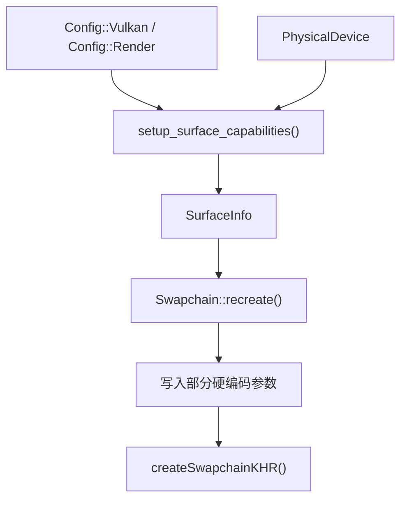
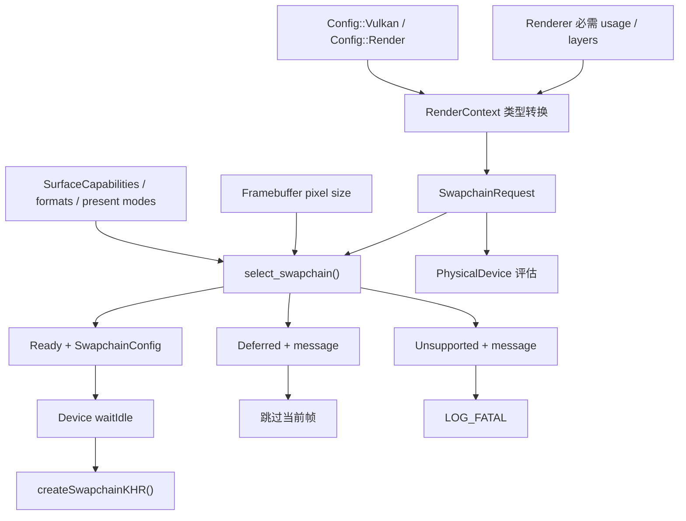
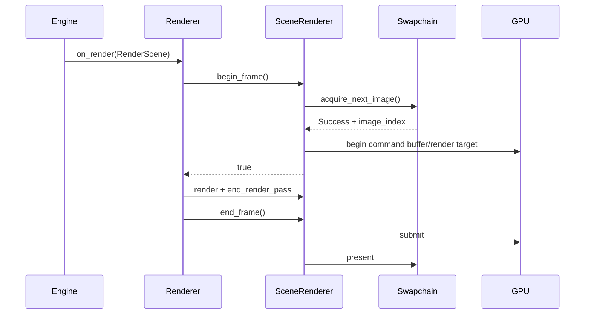

# Swapchain Capability 选择与重建改造详解

本文说明 GFX-007 的代码改造，重点对比改造前后的实现，解释 Swapchain 参数如何从硬编码变为基于
`vk::SurfaceCapabilitiesKHR` 的显式选择，以及窗口尺寸为零时渲染帧如何安全退出。

涉及的主要文件：

- `engine/src/graphics/swapchain.h`
- `engine/src/graphics/swapchain.cpp`
- `engine/src/graphics/vk_capability.h`
- `engine/src/graphics/vk_capability.cpp`
- `engine/src/core/window.h`
- `engine/src/core/window.cpp`
- `engine/src/core/engine.cpp`
- `engine/src/render/render_context.cpp`
- `engine/src/render/renderer.cpp`
- `engine/src/render/scene_renderer.h`
- `engine/src/render/scene_renderer.cpp`
- `tests/graphics/test_swapchain.cpp`

## 1. 改造目标

旧实现虽然会查询 Surface capability、format 和 present mode，但只有 image count 完整考虑了 Surface 限制。
其余参数包含以下固定假设：

```cpp
create_info.imageExtent = m_surface_info.capabilities.currentExtent;
create_info.imageUsage = vk::ImageUsageFlagBits::eColorAttachment;
create_info.preTransform = vk::SurfaceTransformFlagBitsKHR::eIdentity;
create_info.compositeAlpha = vk::CompositeAlphaFlagBitsKHR::eInherit;
create_info.clipped = VK_FALSE;
```

这些值在当前桌面环境中可能工作，但不是所有 Surface 都保证支持：

- `currentExtent` 可能是 `UINT32_MAX`，表示应用必须自行选择 extent。
- `eIdentity` 不一定包含在 `supportedTransforms` 中。
- `eInherit` 不一定包含在 `supportedCompositeAlpha` 中。
- 请求的 image usage 必须是 `supportedUsageFlags` 的子集。
- 窗口最小化时 framebuffer 可能为零，不能创建零尺寸 Swapchain。
- `VK_FALSE` 会要求实现保留被遮挡区域内容，一般 app/editor 没有这个需求。

本次改造的目标是把两个问题分离：

```text
参数选择：给定项目偏好和 Surface 能力，最终应该使用什么参数？

资源重建：使用已经确认合法的参数创建 Swapchain 和相关资源。
```

参数选择被实现为纯函数，因此无需真实 Window、Surface 或 GPU 就能测试。

## 2. 整体链路对比

### 2.1 改造前



`SurfaceInfo` 只保存：

```cpp
struct SurfaceInfo {
    vk::SurfaceCapabilitiesKHR capabilities;
    vk::SurfaceFormatKHR surface_format;
    vk::PresentModeKHR present_mode;
};
```

这个结构混合了“驱动公开的原始能力”和“应用已经选择的值”，但又没有保存 transform、alpha、usage、layers、
clipped 等最终创建参数，因此 `recreate()` 仍需自行决定或硬编码这些值。

### 2.2 改造后



新链路明确区分三类数据：

```text
SwapchainRequest
  = Config 中的可调策略转换为 Vulkan 类型
    再合并 Renderer 当前必需的 usage

SurfaceCapabilitiesKHR / formats / present modes
  = 平台和驱动允许使用的值

SwapchainConfig
  = 二者协商后的最终创建参数
```

## 3. 数据结构变化

### 3.1 改造前：一个不完整的 SurfaceInfo

```cpp
struct SurfaceInfo {
    vk::SurfaceCapabilitiesKHR capabilities;
    vk::SurfaceFormatKHR surface_format;
    vk::PresentModeKHR present_mode;
};
```

成员 `m_surface_info` 同时被用于保存原始 capability 和部分选择结果：

```cpp
SurfaceInfo m_surface_info;
```

### 3.2 改造后：Request、Config 和 Result

运行期请求：

```cpp
struct SwapchainRequest {
    uint32_t image_count = 3;
    vk::SurfaceFormatKHR surface_format{
        vk::Format::eB8G8R8A8Srgb,
        vk::ColorSpaceKHR::eSrgbNonlinear
    };
    vk::PresentModeKHR present_mode = vk::PresentModeKHR::eFifo;
    vk::ImageUsageFlags usage = vk::ImageUsageFlagBits::eColorAttachment;
};
```

最终选择：

```cpp
struct SwapchainConfig {
    uint32_t image_count = 0;
    uint32_t image_layers = 1;
    vk::Extent2D extent;
    vk::SurfaceFormatKHR surface_format;
    vk::PresentModeKHR present_mode = vk::PresentModeKHR::eFifo;
    vk::SurfaceTransformFlagBitsKHR transform =
        vk::SurfaceTransformFlagBitsKHR::eIdentity;
    vk::CompositeAlphaFlagBitsKHR composite_alpha =
        vk::CompositeAlphaFlagBitsKHR::eOpaque;
    vk::ImageUsageFlags usage = vk::ImageUsageFlagBits::eColorAttachment;
    bool clipped = true;
};
```

选择状态：

```cpp
enum class SwapchainStatus {
    Ready,
    Deferred,
    Unsupported
};
```

完整结果：

```cpp
struct SwapchainResult {
    SwapchainStatus status = SwapchainStatus::Unsupported;
    SwapchainConfig config;
    std::string message;
};
```

三个状态的语义如下：

| 状态 | 含义 | 调用方行为 |
| --- | --- | --- |
| `Ready` | 所有必需参数均已确定 | 创建或重建 Swapchain |
| `Deferred` | 当前状态暂时不能创建，例如 framebuffer 为零 | 保留现有资源并跳过当前帧 |
| `Unsupported` | 缺少必需能力 | 输出明确原因并终止初始化或运行 |

`message` 的严重级别由状态决定：`Deferred` 时解释延迟原因，`Unsupported` 时解释硬性失败，`Ready` 时表示发生了
非致命回退。例如配置请求 Mailbox，但 Surface 只支持 FIFO 时，结果仍然是 `Ready`，并在 `message` 中记录回退。

### 3.3 为什么 Request 不直接放进 Config

真正适合项目配置的策略原本就已经位于 YAML：

```text
vulkan.surface_format
vulkan.color_space
vulkan.present_mode
vulkan.swapchain_image_count
render.enable_vsync
```

`SwapchainRequest` 不是另一份用户配置，而是 `RenderContext` 构造的 Vulkan 类型运行期对象：

```text
Config 中的 int / bool / uint32_t
  -> 转换为 vk::Format / vk::ColorSpaceKHR / vk::PresentModeKHR
  -> 应用 VSync 对 present mode 的策略覆盖
  -> 合并 Renderer 必需的 ColorAttachment usage
  -> 生成一份 SwapchainRequest
```

`image_layers = 1` 和 `ColorAttachment` 不是用户偏好。它们由当前渲染路径决定；把它们暴露到 YAML 会允许用户配置
出引擎无法工作的组合。以后实现立体呈现、截图或 blit 时，应由对应功能向 Request 增加需求，而不是提前开放无效开关。

## 4. Surface capability 纯选择函数

新增接口：

```cpp
[[nodiscard]] COMET_API SwapchainResult select_swapchain(
    const vk::SurfaceCapabilitiesKHR& capabilities,
    const std::vector<vk::SurfaceFormatKHR>& surface_formats,
    const std::vector<vk::PresentModeKHR>& present_modes,
    vk::Extent2D framebuffer_extent,
    const SwapchainRequest& request);
```

接口和实现位于 `vk_capability.h/.cpp`。这里使用 `COMET_API`，是因为 engine 是动态库，测试目标需要调用这个函数。
函数只消费值对象，不持有 Vulkan 资源，也不调用驱动创建接口。`swapchain.cpp` 因此只保留查询和资源生命周期代码。

### 4.1 零尺寸处理

改造前没有专门处理零尺寸，`currentExtent` 会被直接写入 create info。

改造后：

```cpp
if(framebuffer_extent.width == 0 || framebuffer_extent.height == 0) {
    return deferred_swapchain("framebuffer extent is zero");
}
```

零尺寸是临时窗口状态，不代表设备不支持 Swapchain，所以使用 `Deferred`，而不是 `Unsupported`。

### 4.2 Image array layers

```cpp
if(capabilities.maxImageArrayLayers < 1) {
    return unsupported_swapchain(
        "surface exposes no swapchain image layers");
}
```

当前基础渲染固定使用一层，所以它不再出现在 Request 中。最终 `SwapchainConfig::image_layers` 为 1，同时显式验证
Surface 至少支持一层。未来加入立体渲染时，再由该功能扩展 Request。

### 4.3 Image usage

改造前：

```cpp
create_info.imageUsage = vk::ImageUsageFlagBits::eColorAttachment;
```

这个值没有与 `supportedUsageFlags` 比较。

改造后：

```cpp
if(!static_cast<bool>(request.usage
    & vk::ImageUsageFlagBits::eColorAttachment)) {
    return unsupported_swapchain(
        "swapchain usage must include color attachment");
}
if((capabilities.supportedUsageFlags & request.usage)
    != request.usage) {
    return unsupported_swapchain(
        "surface does not support the required swapchain usage");
}
```

第一项检查项目请求本身是否满足当前渲染器需求；第二项检查所有请求位是否都是 Surface 支持位的子集。
以后截图功能加入 `eTransferSrc` 时，可以直接把它加入 request，并复用相同验证。

### 4.4 Surface format

改造前会先默认选择第一种格式，再尝试寻找配置值：

```cpp
m_surface_info.surface_format = surface_formats[0];
for(const auto& format: surface_formats) {
    if(format.format == desired_surface_format
        && format.colorSpace == desired_color_space) {
        m_surface_info.surface_format = format;
        break;
    }
}
```

找不到配置格式时会静默使用第一项，设备选择阶段和 Swapchain 阶段可能产生不同假设。

改造后由 `vk_capability.cpp` 内的共享 helper 匹配：

```cpp
std::optional<vk::SurfaceFormatKHR> find_surface_format(
    const std::vector<vk::SurfaceFormatKHR>& formats,
    vk::SurfaceFormatKHR requested) {
    const auto exact_match = std::ranges::find(formats, requested);
    if(exact_match != formats.end()) {
        return *exact_match;
    }
    if(formats.size() == 1
        && formats.front().format == vk::Format::eUndefined
        && formats.front().colorSpace == requested.colorSpace) {
        return requested;
    }
    return std::nullopt;
}
```

物理设备评估和 Swapchain 选择都调用这个 helper，因此不会出现一层接受、另一层拒绝。它同时处理单个
`VK_FORMAT_UNDEFINED` 表示应用可以自行选择 format 的 Vulkan 特殊规则，但仍要求 color space 匹配。

### 4.5 Image count

改造前已经具备基本限制逻辑：

```cpp
const uint32_t min_count = capabilities.minImageCount;
const uint32_t max_count = capabilities.maxImageCount;
auto image_count = config.swapchain_image_count;
if(max_count > 0) {
    image_count = std::clamp(image_count, min_count, max_count);
} else {
    image_count = std::max(image_count, min_count);
}
```

改造后保留这条规则，但将结果写入 `SwapchainConfig`：

```cpp
if(capabilities.maxImageCount == 0) {
    config.image_count = std::max(
        request.image_count, capabilities.minImageCount);
} else {
    config.image_count = std::clamp(
        request.image_count,
        capabilities.minImageCount,
        capabilities.maxImageCount);
}
```

`maxImageCount == 0` 在 Vulkan 中表示没有显式上限，而不是最多只能创建零张 image。额外的零值检查用于防御
人工构造的异常 capability 数据。

### 4.6 Extent

改造前：

```cpp
create_info.imageExtent = capabilities.currentExtent;
```

改造后：

```cpp
constexpr uint32_t variable_extent =
    std::numeric_limits<uint32_t>::max();
if(capabilities.currentExtent.width != variable_extent
    && capabilities.currentExtent.height != variable_extent) {
    config.extent = capabilities.currentExtent;
} else {
    config.extent.width = std::clamp(
        framebuffer_extent.width,
        capabilities.minImageExtent.width,
        capabilities.maxImageExtent.width);
    config.extent.height = std::clamp(
        framebuffer_extent.height,
        capabilities.minImageExtent.height,
        capabilities.maxImageExtent.height);
}
```

两种路径的含义：

```text
currentExtent 是固定值
  -> presentation engine 决定尺寸，应用直接使用

currentExtent 是 UINT32_MAX
  -> 应用读取 framebuffer 像素尺寸
  -> 分别限制到 Surface 的最小和最大 extent
```

这里必须使用 framebuffer pixel size，而不是逻辑 window size。高 DPI 环境下，一个逻辑窗口单位可能对应多个实际
像素，Swapchain image 的尺寸必须与实际渲染像素匹配。

### 4.7 Pre-transform

改造前：

```cpp
create_info.preTransform = vk::SurfaceTransformFlagBitsKHR::eIdentity;
```

改造后：

```cpp
if(!static_cast<bool>(capabilities.supportedTransforms
    & capabilities.currentTransform)) {
    return unsupported_swapchain(
        "surface current transform is not supported");
}
config.transform = capabilities.currentTransform;
```

当前渲染器没有自行旋转画面或交换 extent，因此使用 Surface 当前 transform，让 presentation engine 按平台当前
方向处理。只有未来 Renderer 明确处理显示方向时，才适合优先请求 identity。

### 4.8 Composite alpha

改造前：

```cpp
create_info.compositeAlpha = vk::CompositeAlphaFlagBitsKHR::eInherit;
```

改造后：

```cpp
const std::array alpha_preference = {
    vk::CompositeAlphaFlagBitsKHR::eOpaque,
    vk::CompositeAlphaFlagBitsKHR::ePreMultiplied,
    vk::CompositeAlphaFlagBitsKHR::ePostMultiplied,
    vk::CompositeAlphaFlagBitsKHR::eInherit
};

const auto alpha = std::ranges::find_if(
    alpha_preference,
    [&capabilities](const vk::CompositeAlphaFlagBitsKHR candidate) {
        return static_cast<bool>(
            capabilities.supportedCompositeAlpha & candidate);
    });
```

普通 app/editor 窗口优先使用 Opaque。只有 Opaque 不可用时，才依次尝试其他模式。若一个合法模式都不存在，返回
`Unsupported` 并输出明确原因。

### 4.9 Present mode

改造前先使用第一种模式，再尝试寻找配置值：

```cpp
m_surface_info.present_mode = present_modes[0];
for(const auto& mode: present_modes) {
    if(mode == desired_present_mode) {
        m_surface_info.present_mode = mode;
        break;
    }
}
```

改造后：

```cpp
if(std::ranges::find(present_modes, request.present_mode)
    != present_modes.end()) {
    result.config.present_mode = request.present_mode;
} else {
    const auto fifo = std::ranges::find(
        present_modes, vk::PresentModeKHR::eFifo);
    result.config.present_mode = fifo != present_modes.end()
        ? vk::PresentModeKHR::eFifo
        : present_modes.front();
    result.message = "requested present mode is unavailable; using "
        + vk::to_string(result.config.present_mode);
}
```

回退本身仍然允许程序运行，但不再静默发生。FIFO 是 Vulkan 保证支持的基础模式；`front()` 是针对异常输入的防御性
后备路径。

### 4.10 Clipped

改造前：

```cpp
create_info.clipped = VK_FALSE;
```

改造后默认选择：

```cpp
bool clipped = true;
```

这允许 presentation engine 忽略被其他窗口遮挡的区域。Comet 当前不需要读取被遮挡区域的 Swapchain 内容，因此
`VK_TRUE` 更符合普通 app/editor 的呈现方式。

## 5. Swapchain::recreate() 变化

### 5.1 实时查询能力

改造前通过独立的 `setup_surface_capabilities()` 更新部分成员。

改造后，`recreate()` 在每次执行时查询完整输入：

```cpp
const auto physical_device = m_context->get_physical_device();
const auto surface = m_context->get_surface();
const auto capabilities =
    physical_device.getSurfaceCapabilitiesKHR(surface);
const auto surface_formats =
    physical_device.getSurfaceFormatsKHR(surface);
const auto present_modes =
    physical_device.getSurfacePresentModesKHR(surface);
const auto framebuffer_size = m_window.get_framebuffer_size();
```

Surface 状态可能随窗口、显示器和平台变化，因此重建时需要重新查询，不能永久使用初始缓存。

### 5.2 RenderContext 只转换一次配置

```cpp
const SwapchainRequest swapchain_request{
    .image_count = vulkan_config.swapchain_image_count,
    .surface_format = {
        static_cast<vk::Format>(vulkan_config.surface_format),
        static_cast<vk::ColorSpaceKHR>(vulkan_config.color_space)
    },
    .present_mode = present_mode,
    .usage = vk::ImageUsageFlagBits::eColorAttachment
};

const DeviceCapabilityRequest capability_request{
    .swapchain = swapchain_request,
    .depth_format = static_cast<vk::Format>(vulkan_config.depth_format),
    .sample_count = static_cast<vk::SampleCountFlagBits>(
        vulkan_config.msaa_samples),
    .max_sampler_anisotropy = render_config.max_anisotropy
};
```

`RenderContext` 是普通项目配置进入 Vulkan 后端的边界。它只转换一次 format、color space、present mode 和 image
count，并把同一份 `SwapchainRequest` 同时交给 `DeviceCapabilityRequest` 与 `Swapchain`。VSync 开启时，present mode
在这里被覆盖为 FIFO。`Swapchain` 不再保存或读取整份 `Config::Vulkan` 和 `Config::Render`。

### 5.3 三种结果分别处理

```cpp
if(result.status == SwapchainStatus::Deferred) {
    LOG_DEBUG("Swapchain recreation deferred: {}", result.message);
    return false;
}
if(result.status == SwapchainStatus::Unsupported) {
    LOG_FATAL("Cannot create Vulkan swapchain: {}", result.message);
}
if(!result.message.empty()) {
    LOG_WARN("Swapchain selection: {}", result.message);
}
```

`recreate()` 返回 `bool` 的原因正是需要把临时延迟传递给上层。硬性能力缺失不使用 `false`，否则调用方无法区分
“稍后重试”和“永远无法运行”。

### 5.4 Wait idle 的位置

改造前由 `SceneRenderer::recreate_swapchain()` 在调用 Swapchain 之前执行：

```cpp
device->wait_idle();
swapchain->recreate();
```

这样即使窗口尺寸为零，也会先等待整个 Device。

改造后：

```cpp
const auto result = select_swapchain(...);
if(result.status == SwapchainStatus::Deferred) {
    return false;
}

m_device->wait_idle();
```

只有选择结果为 `Ready` 才等待 GPU。当前仍使用简单的全设备等待，以确保旧 framebuffer、image view 和 Swapchain
不再被任何提交使用。后续 generation/retire 机制可以使用 fence 延迟回收替代全局等待，但不属于本次范围。

### 5.5 Queue sharing mode

```cpp
if(m_context->is_same_queue_families()) {
    image_sharing_mode = vk::SharingMode::eExclusive;
} else {
    image_sharing_mode = vk::SharingMode::eConcurrent;
    queue_family_indices.push_back(graphics_family);
    queue_family_indices.push_back(present_family);
}
```

相同 queue family 使用 Exclusive；不同 family 使用 Concurrent。Exclusive 模式下：

```cpp
create_info.queueFamilyIndexCount = 0;
create_info.pQueueFamilyIndices = nullptr;
```

不会再把空 vector 的 `data()` 作为无意义指针传入 Vulkan。

### 5.6 使用 Config 构造 CreateInfo

改造后所有相关字段来自同一个选择结果：

```cpp
create_info.minImageCount = config.image_count;
create_info.imageFormat = config.surface_format.format;
create_info.imageColorSpace = config.surface_format.colorSpace;
create_info.imageExtent = config.extent;
create_info.imageArrayLayers = config.image_layers;
create_info.imageUsage = config.usage;
create_info.preTransform = config.transform;
create_info.compositeAlpha = config.composite_alpha;
create_info.presentMode = config.present_mode;
create_info.clipped = config.clipped ? VK_TRUE : VK_FALSE;
```

这保证“测试过的参数”和“实际写入 Vulkan 的参数”是同一份数据。

### 5.7 新旧 Swapchain 交接

```cpp
const vk::SwapchainKHR old_swapchain = m_swapchain;
create_info.oldSwapchain = old_swapchain;

m_swapchain = m_device->get().createSwapchainKHR(create_info);
const auto images = m_device->get().getSwapchainImagesKHR(m_swapchain);
```

先创建新 Swapchain，再重新包装其 images：

```cpp
m_images.clear();
m_images.reserve(images.size());
for(const auto image : images) {
    m_images.emplace_back(Image::wrap(m_device, image, image_info));
}
```

最后提交本次选择并销毁旧 Swapchain：

```cpp
m_config = config;
m_current_index = static_cast<uint32_t>(-1);

if(old_swapchain) {
    m_device->get().destroySwapchainKHR(old_swapchain);
}
```

`m_current_index` 被重置为无效哨兵，下一次 `acquireNextImageKHR()` 成功后才写入新 image index。

### 5.8 结构化日志

改造前只输出 image 数量，以及零散的 extent、format 和 present mode Debug 日志。

改造后一次输出完整选择：

```text
images
extent
format / color space
present mode
transform
composite alpha
usage
array layers
clipped
```

这能直接比较不同平台和 GPU 的最终参数，而不需要从多处日志推断。

## 6. Window 与最小化处理

### 6.1 获取 framebuffer 像素尺寸

新增：

```cpp
Math::Vec2u Window::get_framebuffer_size() const {
    int width = 0;
    int height = 0;
    glfwGetFramebufferSize(m_window, &width, &height);
    return {
        static_cast<uint32_t>(std::max(width, 0)),
        static_cast<uint32_t>(std::max(height, 0))
    };
}
```

GLFW 返回有符号整数，`std::max(value, 0)` 防止异常负值转换成巨大的无符号数。

### 6.2 阻塞等待窗口事件

新增：

```cpp
void Window::wait_events() {
    PROFILE_SCOPE("Window::WaitEvents");
    glfwWaitEvents();
}
```

`poll_events()` 立即返回，适合正常连续渲染；`wait_events()` 会阻塞到出现窗口事件，适合最小化或零尺寸状态。

### 6.3 Engine 主循环变化

改造前：

```cpp
m_window->poll_events();
m_timer->tick();
// update, extract, render
```

改造后：

```cpp
m_window->poll_events();
if(m_window->should_close()) {
    break;
}

const auto framebuffer_size = m_window->get_framebuffer_size();
if(framebuffer_size.x == 0 || framebuffer_size.y == 0) {
    m_window->wait_events();
    m_timer->tick();
    continue;
}
```

执行顺序很重要：

1. 先处理已经到达的 GLFW 事件。
2. 再次检查 close，避免关闭事件已处理后又进入阻塞等待。
3. framebuffer 为零时，不执行 update、Scene 提取和渲染。
4. 使用 `wait_events()` 阻塞，不反复 acquire 或重建。
5. 唤醒后调用一次 `Timer::tick()` 消费暂停时间。
6. 下一轮正常帧获得较小的 `deltaTime`，不会因长时间最小化而突然跳变。

若一次无关事件将窗口唤醒，但 framebuffer 仍为零，下一轮会再次进入等待，而不是持续空转。

## 7. SceneRenderer 帧状态传播

### 7.1 begin_frame 返回值变化

改造前：

```cpp
uint32_t SceneRenderer::begin_frame();
```

这个 image index 没有被调用者使用，因为 SceneRenderer 和 FrameManager 已经在内部保存当前 image 状态。

改造后：

```cpp
[[nodiscard]] bool SceneRenderer::begin_frame();
```

返回值改为表达“当前帧是否已经成功开始”。

### 7.2 Acquire OutOfDate

改造前：

```cpp
if(acquire_result == vk::Result::eErrorOutOfDateKHR) {
    recreate_swapchain();
    std::tie(image_index, acquire_result) = acquire_next_image(...);
}
```

`recreate_swapchain()` 无返回值，因此无法表达窗口为零时应该停止当前帧。

改造后：

```cpp
if(acquire_result == vk::Result::eErrorOutOfDateKHR) {
    if(!recreate_swapchain()) {
        return false;
    }
    std::tie(image_index, acquire_result) = acquire_next_image(...);
}
```

返回 `false` 时尚未开始 command buffer，也没有进入 render pass，因此上层可以安全跳过 render、submit 和 present。

### 7.3 Renderer 提前结束

改造前：

```cpp
m_scene_renderer->begin_frame();
const RenderSubmission submission = resolve(...);
render(submission);
end_frame();
```

改造后：

```cpp
if(!m_scene_renderer->begin_frame()) {
    return;
}
```

只有 begin 成功才继续：

```text
resolve scene
  -> record scene draw
  -> record ImGui draw
  -> submit
  -> present
```

### 7.4 Present OutOfDate

```cpp
if(result == vk::Result::eSuboptimalKHR
    || result == vk::Result::eErrorOutOfDateKHR) {
    static_cast<void>(recreate_swapchain());
}
```

这里显式转换为 `void`，用于说明调用方有意忽略 `[[nodiscard]]` 结果。Present 发生在帧末，此帧已经提交，若重建
被延迟，只能在下一帧继续处理。

### 7.5 只在重建成功后更新依赖资源

改造前：

```cpp
device->wait_idle();
swapchain->recreate();
recreate_render_target();
initialize_swapchain_images();
notify_imgui();
```

改造后：

```cpp
if(!swapchain->recreate()) {
    return false;
}

recreate_render_target();
initialize_swapchain_images();
notify_imgui();
return true;
```

RenderTarget、FrameManager per-image 状态和 ImGui framebuffer 只会在新 Swapchain 确实存在后重建，不会在零尺寸
延迟期间破坏当前资源。

## 8. 正常帧与异常帧完整链路

### 8.1 正常帧



### 8.2 Acquire 返回 OutOfDate，但窗口尺寸有效

```text
acquire -> OutOfDate
  -> select_swapchain() 返回 Ready
  -> waitIdle
  -> 创建新 Swapchain
  -> 重建 per-image 与 ImGui 资源
  -> 对新 Swapchain 再次 acquire
  -> 当前帧继续
```

### 8.3 窗口尺寸为零

```text
Engine 查询 framebuffer size == 0
  -> glfwWaitEvents
  -> 不进入 Renderer
```

若尺寸在 Engine 检查之后才变成零：

```text
acquire -> OutOfDate
  -> Swapchain::recreate()
  -> select_swapchain() 返回 Deferred
  -> SceneRenderer::begin_frame() 返回 false
  -> Renderer 跳过当前帧
  -> 下一轮 Engine 进入 glfwWaitEvents
```

两层检查分别处理“进入渲染前已经为零”和“渲染过程中窗口状态发生变化”。

## 9. 单元测试

测试文件 `tests/graphics/test_swapchain.cpp` 使用人工构造的 capability，不创建 Vulkan instance、Surface 或 Device。

公共测试数据包括：

```text
image count: 2..4
fixed extent: 800x600
variable extent range: 64x64..1920x1080
transforms: Identity + Rotate90
current transform: Rotate90
composite alpha: Opaque + Inherit
usage: ColorAttachment
present modes: FIFO + Mailbox
```

测试覆盖：

| 测试 | 验证内容 |
| --- | --- |
| `UsesFixedExtentAndSurfaceTransform` | 固定 extent、current transform、Opaque、Mailbox、clipped |
| `ClampsVariableExtentWithoutImageCountUpperLimit` | 可变 extent、宽高 clamp、无 image count 上限 |
| `DefersZeroSizedFramebuffer` | 零尺寸返回 Deferred |
| `FallsBackToFifoAndSupportedCompositeAlpha` | present mode 和 composite alpha 回退 |
| `RejectsUnsupportedRequiredImageUsage` | Surface 不支持必需 usage 时拒绝 |
| `RejectsZeroImageCount` | 防御异常零 image count |
| `AcceptsUndefinedSurfaceFormat` | `VK_FORMAT_UNDEFINED` 使用请求格式 |
| `RejectsMissingFormatAndCompositeAlpha` | 缺少格式或合法 alpha 时拒绝 |

本次验证结果：

```text
Debug build: passed
Release build: passed
CTest: 105/105 passed
Editor + Vulkan Validation: started and rendered without validation errors
git diff --check: passed
```

## 10. 所有权与生命周期

`Swapchain` 新增：

```cpp
const Window& m_window;
Context& m_context;
Device& m_device;
```

这些都是构造时必须存在、构造后不可重绑定的非 owning 引用。当前所有权关系为：

```text
Engine
├── Window
└── Renderer
    └── RenderContext
        ├── Context
        ├── Device
        └── Swapchain
            ├── const Window&
            ├── Context&
            └── Device&
```

Engine 析构时先销毁 Renderer，再销毁 Window；RenderContext 析构时先销毁 Swapchain，再销毁 Device 和 Context，
因此这些引用在 Swapchain 的完整生命周期内有效。graphics 层其他必需依赖也遵循同一约定：固定且不可为空的借用
使用引用，只有允许为空、需要重绑定或 moved-from 状态需要置空时才保存裸指针。

Swapchain 重建后的依赖更新顺序为：

```text
等待 Device idle
  -> 创建新 Swapchain
  -> 获取并包装新 images
  -> 提交 m_config
  -> 销毁旧 Swapchain
  -> 更新直接渲染 RenderTarget（若使用）
  -> 更新 FrameManager per-image 状态
  -> 通知 ImGui 重建 framebuffer/backend image 状态
```

## 11. 当前限制与后续演进

### 11.1 初始零尺寸仍会终止

构造函数当前行为：

```cpp
if(!recreate()) {
    LOG_FATAL(
        "Cannot create the initial swapchain for a zero-sized framebuffer");
}
```

运行期零尺寸已经支持延迟，但如果程序以隐藏或初始零尺寸窗口启动，Renderer 的后续构造仍要求已有 Swapchain，
因此会终止。未来若要支持完全延迟的渲染器初始化，需要让 RenderTarget、FrameManager 和 ImGui 初始化也接受
“尚无 Swapchain generation”的状态。

### 11.2 重建仍使用 Device waitIdle

当前实现优先保证生命周期正确，重建会等待整个 Device。成熟的后续方案可以引入：

```text
SwapchainGeneration
  -> 新 generation 创建并提交
  -> 旧 generation 与最后使用它的 fence 关联
  -> fence 完成后延迟销毁旧 framebuffer/image view/swapchain
```

这能减少 resize 时的全局停顿，但复杂度明显更高，不应与基础 capability 选择混在一次改动中。

### 11.3 可选 usage

当前 request 只请求 `ColorAttachment`。截图、blit 或后处理加入后，应区分：

```text
required usage
  = 缺失时功能无法工作

optional usage
  = 不支持时关闭对应功能或使用回退路径
```

不应为了尚未实现的功能提前无条件要求 `TransferSrc` 或 `TransferDst`，否则会不必要地缩小设备兼容范围。

## 12. 改造结论

本次改造没有改变正常帧的核心同步关系：

```text
acquire -> record -> submit -> present
```

它改变的是 Swapchain 创建前的决策方式，以及暂时无法创建时的控制流：

```text
旧实现
  = 查询少量能力 + 部分静默回退 + 部分硬编码 + 必须继续创建

新实现
  = 项目偏好 + 完整能力校验 + 显式最终选择
    + Ready/Deferred/Unsupported 状态传播
```

这套结构符合主流渲染后端常见的“Request/Config + generation 重建”方向。当前已经完成 Request/Config 和
安全延迟帧链路；generation 化资源交接、fence retire 和完全延迟初始化属于后续阶段。
